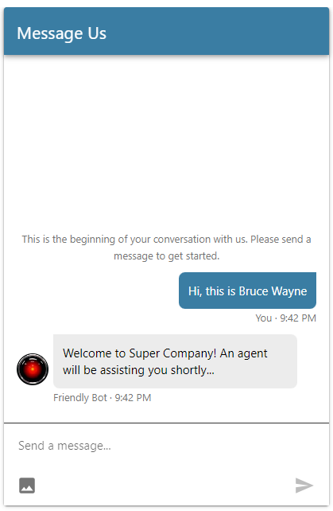

:::{"alert":"primary","title":"About Genesys Cloud Blueprints","autoCollapse":false} 
Genesys Cloud blueprints were built to help you jump-start building an application or integrating with a third-party partner. 
Blueprints are meant to outline how to build and deploy your solutions, not a production-ready turn-key solution.
 
For more details on Genesys Cloud blueprint support and practices 
please see our Genesys Cloud blueprint [FAQ](https://developer.genesys.cloud/blueprints/faq) sheet.
:::

This Genesys Cloud Developer Blueprint provides instructions for deploying a solution which enables businesses to notify their end-users (customers) about undelivered messages sent from the brand (Agent or Bot), while the end-user was not online. You can deploy all the components used in this solution with the Terraform Genesys Cloud CX as Code provider.


## Scenario

A Genesys Cloud agent (or bot) is interacting with an end-user using Web Messaging. When the agent or bot sends a message to the end-user, the end-user's browser might have gone offline (closed or background) which causes the message to be tagged internally with a `deliver-failed` message status. The following steps complete the entire process of notifying the end-user of missed messages:

1. End-user initializes conversation with agent.

2. Agent updates External Contact record with email address of the end-user (alternatively, this can be automated via bots).

3. End-user goes offline (browser closed or background on mobile).

4. Agent replies with some messages: these messages will appear with a delivery failure icon in GC Agent UI.

5. Agent disconnects conversation.

6. End-user receives a new email from Genesys Cloud informing them about new undelivered messages waiting.

## Solution components

* **Genesys Cloud CX** - A suite of Genesys Cloud services for enterprise-grade communications, collaboration, and contact center management. In this solution, you use an Architect workflow, a Genesys Cloud integration, an Email configuration, a Web Messaging deployment, and a Process Automation Trigger.
* **Web messaging and Messenger** - The Genesys Cloud messaging platform that enables asynchronous conversations and a unified agent and supervisor experience across all Genesys Cloud messaging channels. In this solution, it is required to already have an existing configuration for Web Messaging.
* **Genesys Cloud Data Actions** - The Genesys Cloud Data Actions integration allows users to invoke the public API through the Genesys Cloud org. In this solution, there will be 2 data actions which will be called inside an Architect Workflow:
   1. Get Failed Delivery Messages - this Data Action will call the Conversations API and determine if a conversation has any messages with `messageStatus` property equal to `delivery-failed`. This means that a message was sent but was not received by the end-user.
   2. Send Outbound Email - this Data Action will send an agentless notification email to the provided email address.

* **Architect flows** - A flow in Architect, a drag and drop web-based design tool, dictates how Genesys Cloud handles inbound or outbound interactions. In this solution, a workflow is designed to invoke the data actions required for sending an agentless email notification. This workflow is executed by a Process Automation Trigger.
* **Process Automation Triggers** - A feature which allows customers to configure a reaction to specific events that occur within Genesys Cloud. In this solution, we will trigger a workflow everytime a customer has disconnected from a Web Messaging interaction.
* **CX as Code** - A Genesys Cloud Terraform provider that provides an interface for declaring core Genesys Cloud objects.

## Prerequisites

### Specialized knowledge

* Administrator-level knowledge of Genesys Cloud
* Experience with Terraform

### Genesys Cloud account

* A Genesys Cloud license. For more information, see [Genesys Cloud Pricing](https://www.genesys.com/pricing "Opens the Genesys Cloud pricing page") in the Genesys website.
* The Master Admin role. For more information, see [Roles and permissions overview](https://help.mypurecloud.com/?p=24360 "Opens the Roles and permissions overview article") in the Genesys Cloud Resource Center.
* CX as Code. For more information, see [CX as Code](https://developer.genesys.cloud/devapps/cx-as-code/ "Goes to the CX as Code page") in the Genesys Cloud Developer Center.

### Existing Web Messaging configuration

* This blueprint provides a workaround solution for a feature which is not yet native to Web Messaging. The steps and resources created assume that there is already a functioning Web Messaging deployment on the Genesys Cloud org.

For more information regarding Web Messaging, please consult the [article](https://help.mypurecloud.com/articles/web-messaging-overview/ "Go to Web Messaging Overview article") in the Genesys Cloud Resource Center.

### Development tools running in your local environment

* Terraform (the latest binary). For more information, see [Download Terraform](https://www.terraform.io/downloads.html "Goes to the Download Terraform page") on the Terraform website.

## Implementation steps

### Create or use an existing an email domain

In order to send agentless outbound emails, you need to setup your own email domain or subdomain.
If you already configured an email domain in Genesys Cloud, skip the following steps.

To configure a new email domain in Genesys Cloud:

1. In Genesys Cloud, navigate to **Admin** > **Contact Center** > **Email**.
2. Click **Add Domain**.
3. From the **Domain Type** list, select **Campaign/Agentless**.
4. In the **Domain Name** box, type your subdomain name (eg. outbound.my-company.com).
5. Click **Save**.
6. Copy and paste the **TXT** and **CNAME** values into the DNS configuration settings for your specific DNS provider.
7. Wait a few minutes for the DNS information to propagate.
8. Return to **Genesys Cloud** and click **Activate** to verify the email domain

For more information regarding setting up a domain for agentless email notifications check this [article](https://help.mypurecloud.com/articles/set-up-a-domain-for-outbound-email-campaigns/ "Go to article for setting up a domain") in the Genesys Cloud Resrouce Center.

### Download the repository containing the project files

1. Clone the [send-email-notification-when-outbound-message-fails-blueprint repository](https://github.com/GenesysCloudBlueprints/send-email-notification-when-outbound-message-fails-blueprint "Opens the send-email-notification-when-outbound-message-fails-blueprint  repository in GitHub").

### Set up Genesys Cloud

1. To run this project using the Terraform provider, open a Terminal window and set the following environment variables:

   * `GENESYSCLOUD_OAUTHCLIENT_ID` - This variable is the Genesys Cloud client credential grant Id that CX as Code executes against.
   * `GENESYSCLOUD_OAUTHCLIENT_SECRET` - This variable is the Genesys Cloud client credential secret that CX as Code executes against.
   * `GENESYSCLOUD_REGION` - This variable is the Genesys Cloud region in your organization.

2. Run Terraform in the folder where you set the environment variables.

### Configure your Terraform build

1. **Update the variables**
   In the **blueprint/terraform/dev.auto.tfvars** file, set the following values, which are specific to your Genesys Cloud organization:

   * `client_id` - The value of your OAuth Client ID using Client Credentials to be used for the data action integration.
   * `client_secret`- The value of your OAuth Client secret using Client Credentials to be used for the data action integration.
   * `email_address` - This email address will be used as the sender of the agentless email notification. Make sure the email domain is configured within Genesys Cloud.
   * `trigger_delay_in_seconds` - Optional. The delay in seconds after the conversation ends and when the workflow starts checking the conversation for failed-delivery messages. If this variable is omitted, the workflow will start checking as soon as the conversation ends, and send an email if conditions are met. Adding a few seconds will help accomodate any delay in the delivery of outbound messages like bad connectivity, allowing end-users some allowance to read the message.

   The following is an example of the dev.auto.tfvars file.

   ```terraform
   client_id                = "<client id here>"
   client_secret            = "<client secret here>"
   email_address            = "chat_notifications@support.super-company.com"
   trigger_delay_in_seconds = 60 # Optional. Valid range: 60 - 900
   ```

2. **Customize Email content**
   In the **blueprint/terraform/main.tf** file, find the `module "workflow"` section. You may change the subject and body of the email notification that will be sent in this module's properties.

   Example:

   ```terraform
   module "workflow" {
      ...
      email_subject = "Missed Messages from Super Company"
      email_body = "Hi, you may have missed some chat messages from Super Company."
   }
   ```

### Run Terraform

You are now ready to run this blueprint solution for your organization.

1. Change to the **/terraform** folder and issue these commands:

* `terraform init` - This command initializes a working directory containing Terraform configuration files.
  
* `terraform plan` - This command executes a trial run against your Genesys Cloud organization and shows you a list of all the Genesys Cloud resources it creates. Review this list and make sure that you are comfortable with the plan before continuing to the second step.

* `terraform apply --auto-approve` - This command creates and deploys the necessary objects in your Genesys Cloud account. The --auto-approve flag completes the required approval step before the command creates the objects.

After the `terraform apply --auto-approve` command completes, you should see the output of the entire run along with the number of objects successfully created by Terraform. Keep these points in mind:

* This project assumes you are running using a local Terraform backing state, which means that the `tfstate` files are created in the same folder where you run the project. Terraform does not recommend using local Terraform backing state files unless you run from a desktop and are comfortable with the deleted files.

* As long as you keep your local Terraform backing state projects, you can tear down this blueprint solution by changing to the `terraform` folder and issuing a `terraform destroy --auto-approve` command. This command destroys all objects currently managed by the local Terraform backing state.

### Test the solution

1. Go to your website and start a web message.
   
2. Answer the incoming message as an agent.
3. Create a new External Contact record or assign the conversation to an existing one. The Contact's personal email address will be used as recipient of the agentless outbound email.
   
4. Interact with the end-user by sending responses as an agent and vice-versa.
   
5. Close the end-user's session by closing the browser tab or window.
6. Send additional messages as the agent to the end-user. The system should detect that the delivery of the message failed.
   
7. End the conversation.
   
8. Wait for an appropriate amount of time based on the value of the `trigger_delay_in_seconds` variable.
9. An email should be received by the end-user.
   
   

## Additional resources

* [About web messaging](https://help.mypurecloud.com/articles/about-web-messaging/ "Opens the About Web Messaging page")
* [About agentless email notifications](https://help.mypurecloud.com/articles/agentless-email-notifications/ "Open the Agentless email notifications page")
* [About the Genesys Cloud data action integrations](https://help.mypurecloud.com/articles/about-the-data-actions-integrations/ "Opens the About the Genesys Cloud data action integrations page")
* [About Process Automation](https://developer.genesys.cloud/platform/process-automation/ "Opens the Process Automation overview page")
* [send-email-notification-when-outbound-message-fails-blueprint](https://github.com/GenesysCloudBlueprints/send-email-notification-when-outbound-message-fails-blueprint  "Opens the send-email-notification-when-outbound-message-fails-blueprint  repository in GitHub")
